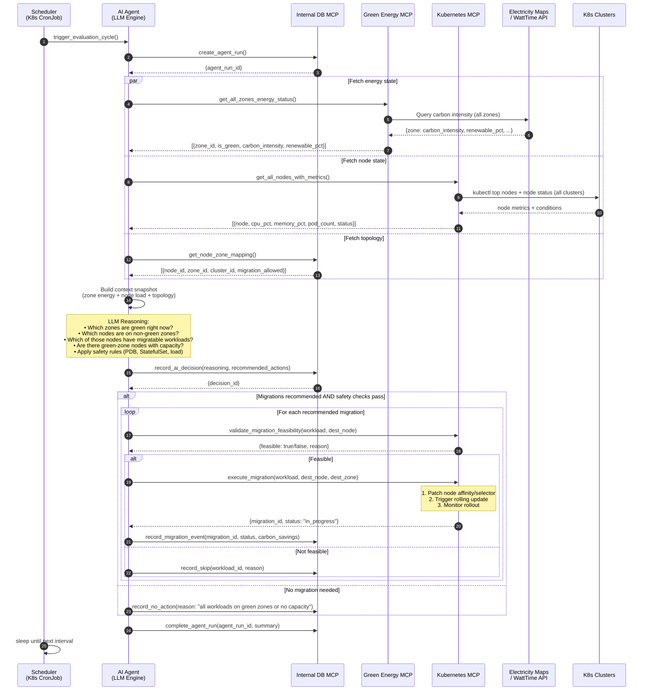
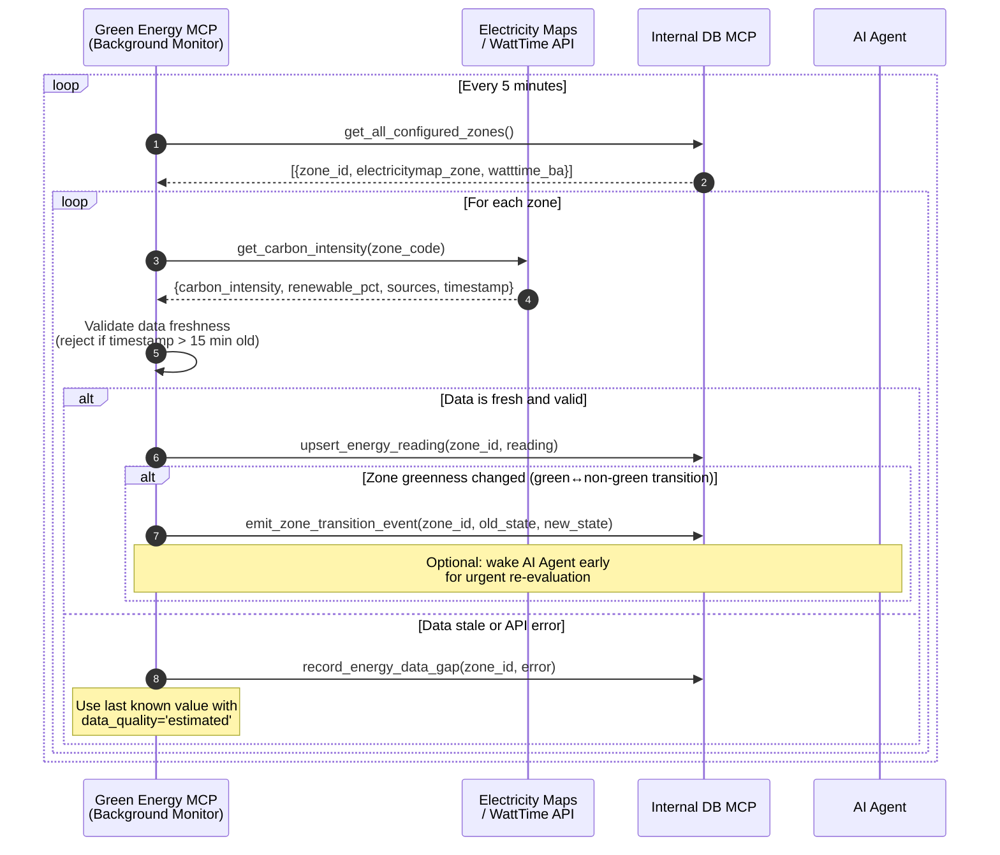
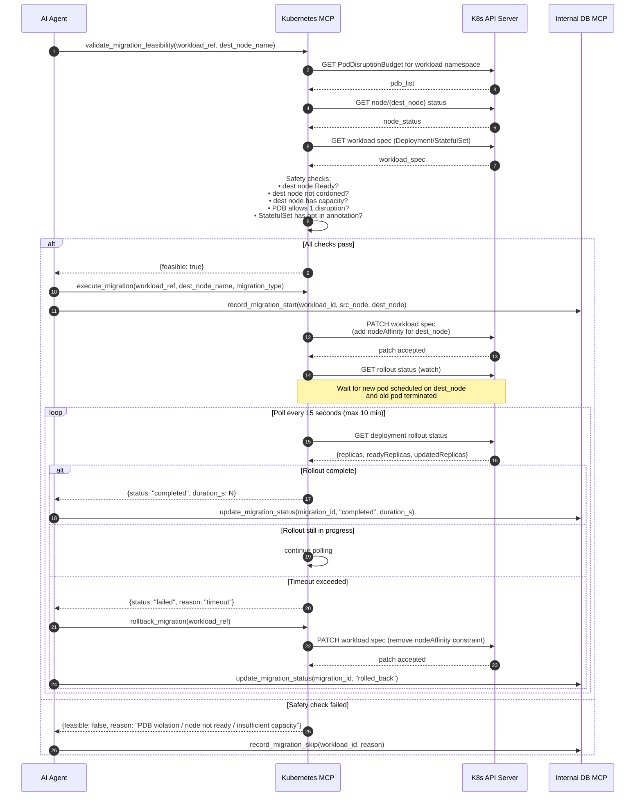
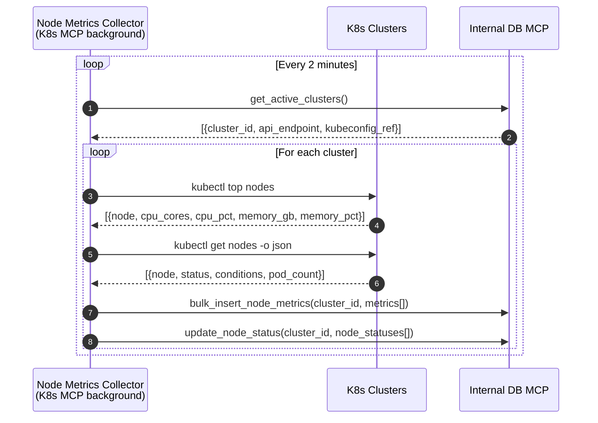
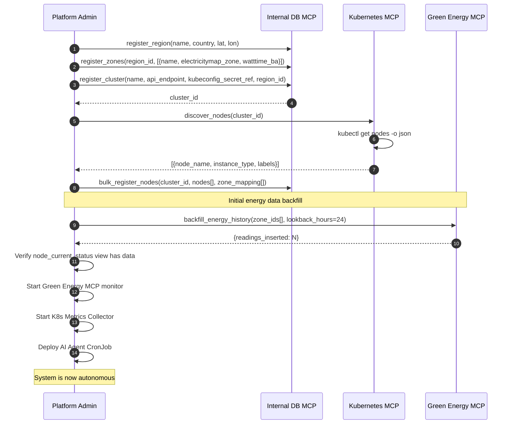

# Sequence Diagrams — Green Workload AI

All diagrams use [Mermaid](https://mermaid.js.org/) syntax.

---

## Diagram 1 — Main Agent Evaluation Cycle

The core autonomous loop that runs every ~10 minutes.

---

## Diagram 2 — Energy Zone Monitoring (Continuous Background Process)

The Green Energy MCP continuously polls carbon intensity APIs and updates the DB.

---

## Diagram 3 — Migration Execution & Status Monitoring

Detailed flow of a single workload migration.

---

## Diagram 4 — Node Metrics Collection

Background process that populates `node_metrics` for AI context.

---

## Diagram 5 — System Bootstrap & Configuration

One-time setup and initial data population.

